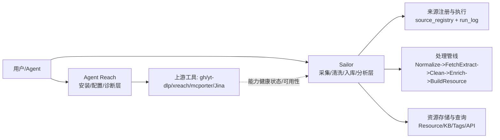
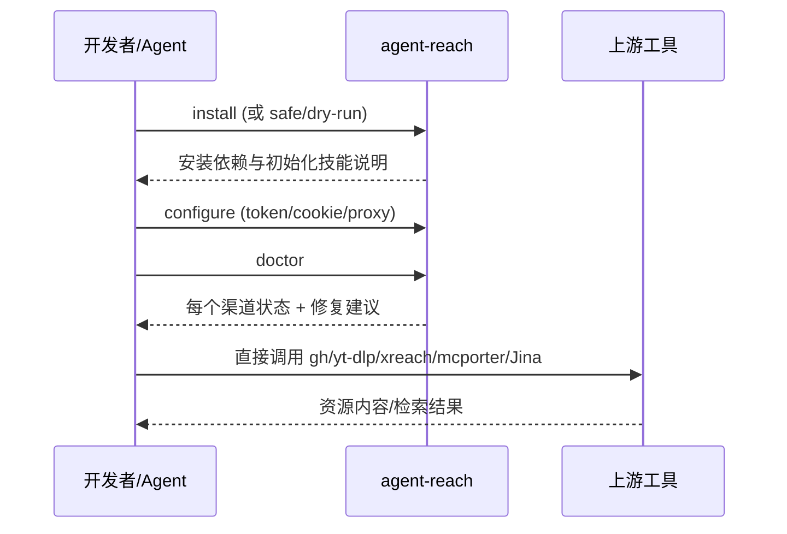
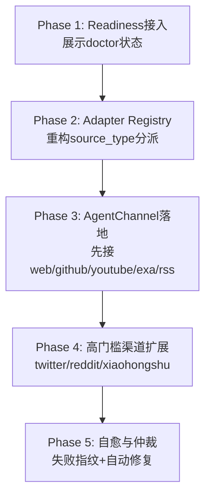

# Sailor × Agent Reach 项目介绍与融合方案报告

## 1. 报告目标

这份文档面向不了解上下文的读者，回答四个问题：

1. Agent Reach 是什么框架、如何使用？
2. Sailor 现在如何配置与读取资源？
3. 两者从产品与技术上如何融合？
4. 有哪些可选路径，如何分阶段落地？

---

## 2. 一图看懂两个项目的角色



### 解释

- **Agent Reach** 更像“能力控制面”：负责安装依赖、检查渠道可用性、给出修复路径。
- **Sailor** 更像“数据处理平面”：负责执行来源采集、标准化、入库、知识处理与对外 API。
- 融合价值不是谁替代谁，而是让 Agent Reach 的“渠道可用性治理”增强 Sailor 的“来源执行成功率”。

---

## 3. Agent Reach 框架介绍

### 3.1 核心架构

```mermaid
flowchart TD
    CLI[agent-reach CLI] --> INSTALL[install]
    CLI --> CONF[configure]
    CLI --> DOC[doctor]
    CLI --> WATCH[watch/check-update]

    DOC --> CHREG[channel registry\nget_all_channels]
    CHREG --> CH1[WebChannel]
    CHREG --> CH2[GitHubChannel]
    CHREG --> CH3[YouTubeChannel]
    CHREG --> CH4[Twitter/Reddit/XHS/...]

    CH1 --> CHECK[check(config) -> ok/warn/off + message]
    CH2 --> CHECK
    CH3 --> CHECK
    CH4 --> CHECK

    CHECK --> REPORT[doctor report\n按 tier 分层展示]
    CONF --> CFG[(~/.agent-reach/config.yaml)]
```

### 3.2 如何使用（对外介绍版）



### 3.3 关键特征

- **定位清晰**：不是统一抓取 Runtime，而是“安装 + 配置 + 诊断 + 上游工具编排”。
- **渠道插件化**：每个 channel 声明 `can_handle/check`、`tier`、`backends`。
- **运维友好**：`doctor` 报告能直接告诉用户缺什么、怎么修。
- **安全边界**：敏感配置本地保存，支持安全模式和 dry-run。

---

## 4. Sailor 的资源读取能力介绍

### 4.1 当前执行架构

```mermaid
flowchart TD
    API[/sources API] --> SR[SourceRepository\nsource_registry/run_log/item_index]
    API --> RUN[run_source / run-by-type]

    RUN --> DISPATCH[_collect_source_entries]
    DISPATCH --> ST1[rss/atom/jsonfeed]
    DISPATCH --> ST2[web_page/manual_file]
    DISPATCH --> ST3[academic_api/api/site_map]
    DISPATCH --> ST4[api_json/api_xml/opml/jsonl]

    ST1 --> RAW[RawEntry[]]
    ST2 --> RAW
    ST3 --> RAW
    ST4 --> RAW

    RAW --> PIPE[Default Pipeline\nNormalize->FetchExtract->Clean->Enrich->BuildResource]
    PIPE --> RES[(ResourceRepository/SQLite)]
    RES --> OUT[/resources /kb /analysis]
```

### 4.2 配置与来源管理

- 支持来源注册、启停、按类型批量执行、运行历史与错误统计。
- 支持本地配置导入（含大规模 RSS 清单）。
- Source 执行日志（fetched/processed/error/metadata）可用于可观测与后续自愈策略。

### 4.3 现状优劣

- **优势**：数据处理链路完整，落库与后续分析能力成熟。
- **短板**：来源适配逻辑集中在单大模块内，外部渠道“就绪度检查”能力相对薄弱。

---

## 5. 融合设计：产品视角 + 技术视角

### 5.1 目标态架构图（推荐）

```mermaid
flowchart LR
    UI[Sailor UI/Agent入口] --> PRE[Preflight Readiness]
    PRE --> DR[Agent Reach Doctor Adapter]
    DR --> CH[Channel Health Matrix\nstatus/tier/backend/message]

    UI --> SRC[Sailor Source Runner]
    SRC --> REG[Source Adapter Registry]
    REG --> SA1[Native Adapters\n(rss/web/api/...)]
    REG --> SA2[AgentChannel Adapter\n(gh/yt-dlp/xreach/mcporter/Jina)]

    SA1 --> PIPE[Sailor Pipeline]
    SA2 --> PIPE
    PIPE --> DB[(Resource + Run Logs)]
    DB --> OBS[失败指纹/告警/修复建议]
```

### 5.2 产品层融合思路

- 在来源页增加 **Readiness**（就绪度）卡片：运行前即可看渠道是否可用。
- 失败后不只报错，而是给出“可执行修复建议”（类似 doctor 提示）。
- 支持“按渠道模板创建来源”，降低新渠道接入复杂度。

### 5.3 技术层融合思路

- 引入 `AgentChannel Adapter`，复用 Sailor `RawEntry -> Pipeline -> Resource` 主链路。
- 引入统一执行契约：命令、超时、重试、stdout/stderr 解析、exit code 映射。
- 凭证策略：Sailor 不持久化敏感凭证，仅保存状态与引用；敏感信息仍由 Agent Reach 本地安全配置管理。

---

## 6. 多种实施方案（含适用场景）

| 方案 | 核心做法 | 优点 | 风险/代价 | 适用阶段 |
|---|---|---|---|---|
| A. Doctor Bridge | 仅把 doctor 状态接入 Sailor 状态页 | 快速落地、低风险 | 不直接增强采集能力 | 0->1 验证 |
| B. Adapter Registry + AgentChannel（推荐） | 把来源分派重构为注册表，新增 Agent 渠道适配 | 复用现有主链路，扩展性高 | 需要统一命令执行与解析 | 主线版本 |
| C. Sidecar Worker | 外部工具调用放到独立 worker | 隔离性强、可靠性高 | 系统复杂度上升 | 中后期高并发 |
| D. 智能仲裁/自愈 | 多通道探测选路 + 失败指纹自动修复 | 成功率最高、可持续优化 | 需要日志数据沉淀 | 成熟期优化 |

---

## 7. 推荐路线图（分阶段）



### 每阶段验收要点

- **P1**：用户可在运行前看到“可用/告警/不可用 + 修复路径”。
- **P2**：新增渠道无需改大段 `if/elif` 分派，改为注册式接入。
- **P3**：至少 3 个 Agent 渠道可稳定进入 Sailor 资源管线。
- **P4**：高门槛渠道接入后，失败原因可定位到认证/代理/依赖。
- **P5**：重复失败率与人工修复时间显著下降。

---

## 8. 主要风险与治理策略

1. **上游工具输出漂移**：建立输出 schema 与回归样例，解析失败时降级并可观测。
2. **同步执行阻塞**：统一超时、并发上限、重试策略，必要时切 Sidecar。
3. **凭证与合规边界不清**：明确“凭证只在 Agent Reach 管理”，Sailor 仅存状态引用。
4. **模块膨胀**：把来源适配从单文件拆为 registry + adapters 子模块。

---

## 9. 对外介绍时可直接复用的结论

- **一句话**：Sailor 是资源处理中台，Agent Reach 是渠道能力治理层，两者融合后可以显著提升多源采集的稳定性和可维护性。
- **推荐策略**：先接入 doctor/readiness，再做 adapter 化重构，最后引入自愈与智能选路。
- **业务价值**：更高采集成功率、更低故障恢复成本、更快渠道扩展速度。

---

## 10. 关键代码锚点（便于读者追溯）

- Sailor 来源执行与分派：`E:\OS\sailor\backend\app\routers\sources.py`
- Sailor 来源与运行日志存储：`E:\OS\sailor\core\storage\source_repository.py`
- Sailor 依赖装配：`E:\OS\sailor\backend\app\container.py`
- Sailor 数据模型：`E:\OS\sailor\core\models.py`
- Agent Reach CLI 入口与命令：`E:\OS\Agent-Reach\agent_reach\cli.py`
- Agent Reach 渠道诊断：`E:\OS\Agent-Reach\agent_reach\doctor.py`
- Agent Reach 渠道注册：`E:\OS\Agent-Reach\agent_reach\channels\__init__.py`
- Agent Reach 使用手册：`E:\OS\Agent-Reach\agent_reach\skill\SKILL.md`
